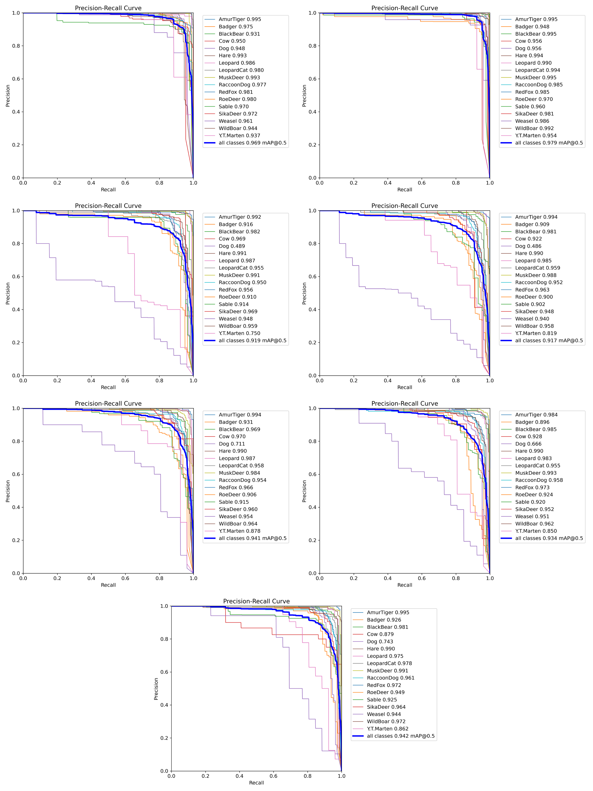

# Night-time Wildlife Detection using YOLOv8 with Attention Modules and Custom Head


 


## Table of Contents

1. [Abstract](#abstract)
2. [Project Overview](#project-overview)
3. [Installation](#installation)
4. [Project Structure](#project-structure)
5. [Methodology](#methodology)
    - [Data Collection and Preprocessing](#data-collection-and-preprocessing)
    - [Model Architecture](#model-architecture)
    - [Training Configuration](#training-configuration)
    - [Evaluation Metrics](#evaluation-metrics)
6. [Results](#results)
7. [Project Poster](#project-poster)
8. [References](#references)
9. [License](#license)

## Abstract

Accurate recognition of wildlife in their natural habitats is essential for ecological research and biodiversity conservation. While object detection models such as YOLO perform well on well-lit, high-resolution datasets, their performance often degrades in low-light environments or infrared camera settings, which are common in real-world field monitoring. 

This project explores architectural modifications to the YOLOv8 object detection model for improved performance on infrared wildlife images captured at night. Specifically, we investigate whether integrating attention mechanisms (OCCAPCC, CBAM) and a custom detection head (Efficient3DBB) can enhance detection accuracy under low-light conditions. We evaluate multiple variants, including YOLOv8n and YOLOv11n baselines, under the same training settings. 

Results show class-dependent improvements, notably for some onw-contrast species (e.g., *BlackBear* and *WildBoar*), but no uniform gains across all classes. Efficient3DBB helps partially recover performance when combined with OCCAPCC, yet overall results remian below the YOLOv8 baseline. In contrast, backbone upgrades (e.g., YOLOv11n) deliver the most consistent improvement, with YOLOv11n achieving the best overall performance. 


## Project Overview

We implement and evaluate the following model variants: 

1. **YOLOv8n**: Baseline model provided by Ultralytics
2. **YOLOv11n**: Baseline model provided by Ultralytics
3. **YOLOv8n + OCCAPCC(end)**: OCCAPCC attention module appended at the end of the backbone
4. **YOLOv8n + OCCAPCC(index 8)**: OCCAPCC inserted at backbone layer 8
5. **YOLOv8n + CBAM**: CBAM module used instead of OCCAPCC
6. **YOLOv8n + OCCAPCC + Efficient3DBB**: Combines OCCAPCC at the end of the backbone with a custom detection head Efficient3DBB
7. **YOLOv8n + CBAM + Efficient3DBB**: Combines CBAM with Efficient3DBB head


## Installation

1. Clone the repository: 

    ``` sh
    git clone https://github.com/ACM40960/project-project-in-maths-modelling
    cd project-project-in-maths-modelling
    ```

2. Create virtual environments: 

    You need to set up three separate environments for running different model variants: 

    - **Baseline** - official Ultralytics YOLOv8 / YOLOv11
    - **Attention** - modified Ultralytics (located in `code/ultralytics_attention`)
    - **Head** - modified Ultralytics with custom detection head (located in `code/ultralytics_head`)


    1. **Baseline Environment**

        ``` sh
        # create and activate environment
        conda create -n yolo_baseline python=3.9 -y
        conda activate yolo_baseline

        # install dependencies
        pip install -r requirements.txt

        # install official ultralytics
        pip install ultralytics
        ```

    2. **Attention Environment**

        ``` sh
        conda create -n yolo_attention python=3.9 -y
        conda activate yolo_attention

        pip install -r requirements.txt

        cd code/ultralytics_attention
        pip install -e .
        cd ../..
        ```

    3. **Head Environment**

        ``` sh
        conda create -n yolo_head python=3.9 -y
        conda activate yolo_head

        pip install -r requirements.txt

        cd code/ultralytics_head
        pip install -e .
        cd ../..
        ```
3. Download the dataset: 

    - Get `voc_night.rar` from the [NTLNP dataset](https://huggingface.co/datasets/myyyyw/NTLNP)
    - Extract the archive directly into the project directory so that the extracted folder is named `voc_night`:

        ```plaintext
        project/
        ├── voc_night/
        │   ├── JPEGImages/
        │   └── Annotations/
        ```

4. Preprocess the dataset:
    
    ``` sh
    cd code
    python preprocessing.py
    ```

    This will create a new folder `yolo_dataset` under the project directory and perform the following steps: 
    
    - Extract class names and save them to `yolo_dataset/classes_names.txt` 
    - Convert the original annotations from Pascal VOC XML to YOLO format 
    - Split the dataset into training, validation, and test sets with a **70% / 10% / 20%** ratio 
    - Generate `yolo_dataset/data.yaml` for YOLO training 
    
    Resulting structure:

    ``` plaintext
    project/
    ├── voc_night/              # original dataset
    │   ├── JPEGImages/
    │   ├── Annotations/
    │   └── YOLOLabels/         # temporary YOLO-format labels
    ├── yolo_dataset/           # processed dataset for YOLO training
    │   ├── images/
    │   │   ├── train
    │   │   ├── valid
    │   │   └── test
    │   ├── labels/
    │   │   ├── train
    │   │   ├── valid
    │   │   └── test
    │   ├── data.yaml           # YOLO dataset configuration file
    │   └── classes_names.txt   # list of all class names
    ```

5. Running training and validation

    - **Baseline Environment** (`yolo_baseline`)

        ``` sh
        conda activate yolo_baseline
        cd code
        python yolo+baseline_train.py
        python yolo+baseline_val_pred.py
        ```

    - **Attention Environment** (`yolo_attention`)

        ``` sh
        conda activate yolo_attention
        cd code
        python yolo+attention_train.py
        python yolo+attention_val_pred.py
        ```

    - **Head Environment** (`yolo_head`)

        ``` sh
        conda activate yolo_head
        cd code
        python yolo+head_train.py
        python yolo+head_val_pred.py
        ```

    This will train the corresponding models, run validation on the test split, generate predictions, and save the following outputs under the `results` directory:

    - Best weights (`results/saved_models/*_best.pt`)
    - Training logs and artefacts (`results/*_train/`)
    - Validation results (`results/*_val/`)
    - Prediction results (`results/*_pred/`)
    - Evaluation metrics (`results/*.json`)

6. Analyze results

    Open [`results/result.ipynb`](results/result.ipynb) to aggregate all JSON metrics into a comparison table.

## Project Structure

``` plaintext
project/ 
├── code/                                       # source code    
│   ├── ultralytics_attention/                  # modified Ultralytics with attention modules
│   │   ├── ultralytics/                        # Ultralytics source code (attention version) 
│   │   ├── ...                                 # other supporting files 
│   │   ├── yolov8+OCCAPCC.yaml                 # YOLO config with OCCAPCC at backbone end
│   │   ├── yolov8+OCCAPCC_index8.yaml          # YOLO config with OCCAPCC at backbone layer 8 
│   │   └── yolov8+CBAM.yaml                    # YOLO config with CBAM 
│   ├── ultralytics_head/                       # modified Ultralytics with custom detect head
│   │   ├── ultralytics/                        # Ultralytics source code (head version)
│   │   ├── ... 
│   │   ├── yolov8+OCCAPCC+Efficient3dbb.yaml   # YOLO config with OCCAPCC + Efficient3DBB
│   │   └── yolov8+CBAM+Efficient3dbb.yaml      # YOLO config with CBAM + Efficient3DBB
│   ├── yolov8n.pt                              # pretrained YOLOv8n weights
│   ├── yolo11n.pt                              # pretrained YOLOv11n weights
│   ├── preprocessing.py                        # script for dataset preprocessing
│   ├── yolo+baseline_train.py                  # training script for YOLOv8n & YOLOv11n baselines
│   ├── yolo+baseline_val_pred.py               # validation & prediction script for baselines
│   ├── yolo+attention_train.py                 # training script for attention models
│   ├── yolo+attention_val_pred.py              # validation & prediction script for attention models 
│   ├── yolo+head_train.py                      # training script for head models
│   └── yolo+head_val_pred.py                   # validation & prediction script for head models
├── results/                                    # model outputs and evaluation results
│   ├── saved_models/                           # best weights from training
│   │   └── *_best.pt 
│   ├── *_val/                                  # validation results (per model)
│   ├── *.json                                  # evaluation results (per model)
│   └── result.ipynb                            # notebook for aggregating metrics 
├── images/                                     # images for README
├── README.md                                   # project documentation
├── requirements.txt                            # Python dependencies
├── Literature_review.pdf                       # literature review document
└── Poster.pdf                                  # project poster
```


## Methodology

### Data Collection and Preprocessing

- **Dataset**: 
    
    *voc_night* subset of the NTLNP dataset containing 10,344 night-time infrared images across 17 animal classes. 

<div align="center">
  
  
  <em>Figure 1. Example images in NTLNP/voc_night.</em>
</div>

- **Annotation Format**: 

    Pascal VOC XML format. 

- **Preprocessing Steps**: 

    Converted to YOLO format, split into train/val/test sets (70% / 10% / 20%), and generated `data.yaml` for YOLO training. *(see [Installation – Step 4](#installation) for execution details)*.

### Model Architecture

- **Baselines**: YOLOv8n, YOLOv11n (official Ultralytics)
- **Attention Models**: YOLOv8n with OCCAPCC (end / index 8) or CBAM
- **Head Models**: YOLOv8n with OCCAPCC or CBAM combined with Efficient3DBB

Full architecture definitions are available in: 

- [Attention Models YAMLs](code/ultralytics_attention/) (`yolov8+OCCAPCC.yaml`, `yolov8+OCCAPCC_index8.yaml`, and `yolov8+CBAM.yaml`)
- [Head Models YAMLs](code/ultralytics_head/) (`yolov8+OCCAPCC+Efficient3dbb.yaml` and `yolov8+CBAM+Efficient3dbb.yaml`)

#### Rationale for Modifications

- **Base Model**: 

    The baseline model is YOLOv8n, a lightweight object detection architecture from the Ultralitics framework. We selected it due to its efficiency and low computational cost, which has made it widely adopted in real-time applications such as wildlife monitoring and other resource-constrained scenarios. 

- **YOLOv11n**: 

    YOLOv11n is an improved version officially released by Ultralytics in 2024. Compared to YOLOv8n, it introduces more efficient building blocks such as `c3k2` and `C2PSA`, and replaces the standard detection head with `YOLOEDetect`. These changes allow YOLOv11n to achieve better accuracy with fewer parameters and lower computational cost. 

- **Attention Modules**: 

    - **OCCAPCC** (appended at the end of the backbone): 

        This module is added at the end of the backbone, to refine high-level semantic features before passing them to the detection head. The rationale is that global context and fine-grained spatial cues extracted by OCCAPCC may help improve detection performance in low-contrast, cluttered scenes scenes typical of night-time infrared images. Based on findings from Wang et al., 2024, placing the attention module at the end of the backbone achieves the best performance in low-light conditions.

    - **OCCAPCC** (inserted at layer 8): 

        In a separate experiment, OCCAPCC is placed mid-backbone (at index 8) to assess whether earlier feature enhancement leads to better representations. This positioning helps evaluate how the depth of attention integration affects model performance. 

    - **CBAM** (inserted before SPPF): 

        CBAM is placed before SPPF block to enhance deep semantic features before multi-scale pooling. This position allows CBAM to operate on rich, uncompressed feature maps, improving channel and spetial attention. According to Woo et al., 2018, CBAM is most effective when applied after backbone blocks. Placing it before SPPF alighs with this recommentation and avoids disrupting the output used by the neck. 

- **Detection Head**: 

    - **Efficient3DBB Head**: 

        Efficient3DBB head replaces YOLOv8 head with diverse-branch block, improving multi-scale fusion and stabilising logits, reducing duplicate boxes. 

<br>
<div align="center">
  
  
  <em>Figure 2. YOLOv8n backbone with OCCAPCC attention at the end of the backbone and Efficient3DBB detection head.</em>
</div>


### Training Configuration

- **Input Size**: 640 $\times$ 640
- **Batch Size**: 16
- **Epochs**: 50


### Evaluation Metrics

- **mAP@0.5**: Mean Average Precision at IoU 0.5
- **mAP@0.5:0.95**: Averaged mAP across IoU thresholds 0.5 ~ 0.95
- **Precision**: Correct detections among all predicted positives
- **Recall**: Correct detections among all actual positives

## Results

### Summary Table 

*Table 1. Performance of different YOLO model variants on the test set, evaluated by mAP@0.5, mAP@0.5:0.95, precision, and recall.*

| Model Variant | mAP@0.5 | mAP@0.5:0.95 | Precision | Recall | 
| ---- | ----: | ----: | ----: | ----: | 
| Baseline YOLOv8n | 0.9690 | 0.8478 | 0.9536 | 0.9090 | 
| **Baseline YOLOv11n** | **0.9786** | **0.8621** | **0.9609** | **0.9537** | 
| YOLOv8n + OCCAPCC (end) | 0.9194 | 0.7476 | 0.9074 | 0.8515 | 
| YOLOv8n + OCCAPCC (index 8) | 0.9174 | 0.7500 | 0.8968 | 0.8334 | 
| YOLOv8n + CBAM |  0.9405 | 0.7669 | 0.8842 | 0.8897 | 
| YOLOv8n + OCCAPCC + Efficient3DBB | 0.9336 | 0.7657 | 0.9131 | 0.8641 | 
| **YOLOv8n + CBAM + Efficient3DBB** | **0.9416** | **0.7739** | **0.9271** | **0.8931** | 

YOLOv11n achieved the highest scores across all metrics (bold in Table 1). Within the YOLOv8n variants, **YOLOv8n + CBAM + Efficient3DBB** obtained the best results (also highlighted in bold), outperforming other YOLOv8n modifications in mAP, precision, and recall.


For the OCCAPCC-based models: 

- **v8 + OCCAPCC**: mAP slightly decreased, but recall improved in low-light cases. 
- **v8 + OCCAPCC + Efficient3DBB**: mAP recovered to 0.9336 and recall further increased to 0.8641, showing better overall performance than OCCAPCC alone. 


### Confusion Matrix

<div align="center">
  
  
  <em>Figure 3. Normalized confusion matrix for YOLOv8n with OCCAPCC attention at the end of the backbone and Efficient3DBB detection head.</em>
</div>

The normalized confusion matrix highlights the strengths and weaknesses of the **v8 + OCCAPCC + Efficient3DBB** model: 

- **High accuracy (>0.9)** for large high-contrast species such as *AmurTiger*, *BlackBear*, and *WildBoar*, indicating stable recognition. 
- **Low accuracies** observed for *Dog (0.31)* and *Y.T.Marten (0.69)*. 

Similar confusion matrices for other models can be found in the [`results/*_val/`](results/) directories. 


### Precision-Recall Curves

<div align="center">
  
  
  <em>Figure 4. Precision-Recall curves for seven models, arranged in two columns and four rows in reading order (top-left → top-right → ... → bottom). The models, in order, are YOLOv8n, YOLOv11n, YOLOv8n + OCCAPCC (end), YOLOv8n + OCCAPCC (index 8), YOLOv8n + CBAM, YOLOv8n + OCCAPCC + Efficient3DBB, and YOLOv8n + CBAM + Efficient3DBB.</em>
</div>


- **Improved classes**: *BlackBear* and *WildBoar* consistently improved across all enhanced models. *Cow* improved in both attention-based variants, but the gain disappeared when the Efficient3DBB head was added. 
- **Degraded classes**: *Dog* performed worse in all enhanced models compared to the baseline, though the addition of Efficient3DBB partially mitigated the drop. 
- **Stable classes**: Large, high-contrast species such as *AmurTiger*, *Leopard*, and *MuskDeer* remained stable across all variants.

For additional metrics such as **F1-score**, **Precision**, **Recall** curves, please refer to the files in the [`results/*_val/`](results/) directories. 


### Prediction Examples

<div align="center">
  
  
  <em>Figure 5. Prediction examples on a sample BlackBear image. The top-left shows the YOLOv8n baseline, which produces duplicate bounding boxes with lower confidence. In contrast, attention-based variants and those with the Efficient3DBB head (other panels) suppress duplicates and increase confidence scores.</em>
</div>

The prediction examples below compared detection results for different model variants on a sample *BlackBear* image. In this case, the baseline YOLOv8n (top-left) produces duplicate bounding boxes with low confidence scores. After adding attention, or attention combined with the custom detection head, the duplicate boxes are removed and confidence scores increase. This highlights the effectiveness of combining attention with a specialized detection head.


## Project Poster

See [Poster.pdf](Poster.pdf) for a visual summary of the project.


## References

[1] NTLNP Dataset - https://huggingface.co/datasets/myyyyw/NTLNP

[2] Ultralytics Document - https://github.com/ultralytics/ultralytics

[3] Tianyu Wang, Siyu Ren, Haiyan Zhang. *Nighttime wildlife object detection based on YOLOv8-night*. Electronics Letters, vol. 60, no. 15, 2024. [https://doi.org/10.1049/ell2.13305](https://doi.org/10.1049/ell2.13305)


[4] Sanghyun Woo, Jongchan Park, Joon-Young Lee, In So Kweon. *CBAM: Convolutional Block Attention Module*. arXiv:1807.06521 [cs.CV], 2018. [https://doi.org/10.48550/arXiv.1807.06521](https://doi.org/10.48550/arXiv.1807.06521)

[5] Wan, D., Lu, R., Hu, B., Yin, J., Shen, S., Xu, T., & Lang, X. (2024). *YOLO-MIF: Improved YOLOv8 with Multi-Information fusion for object detection in gray-scale images.* Advanced Engineering Informatics, 62(B), 102709. [https://doi.org/10.1016/j.aei.2024.102709](https://doi.org/10.1016/j.aei.2024.102709)


# Contributors

This project was developed by [Ting-Yu Hsu](https://github.com/rye1014) and [Yanjie Shao](https://github.com/YanjieShao) as part of the MSc Data and Computational Science programme at UCD.


## License

- Original project code: **MIT License** (see [LICENSE](LICENSE))
- Modified Ultralytics components (`code/ultralytics_attention/`, `code/ultralytics_head/`): **AGPL-3.0 License**  
- A copy of AGPL-3.0 is included in the respective directories.  
